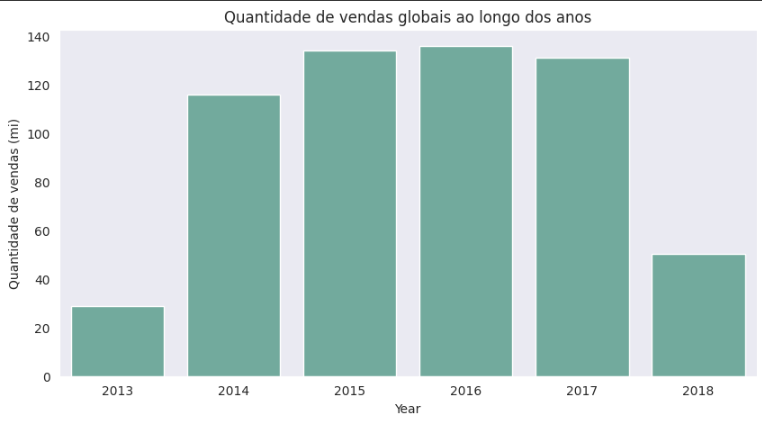
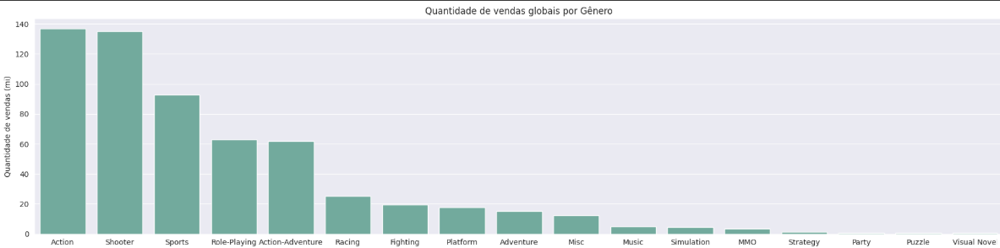
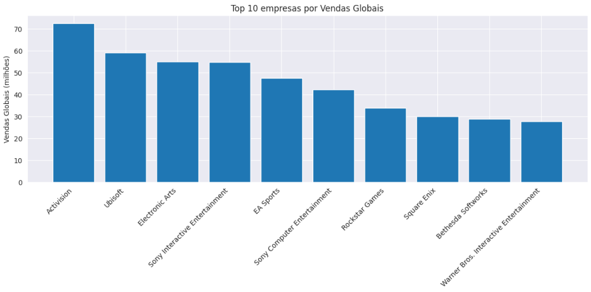
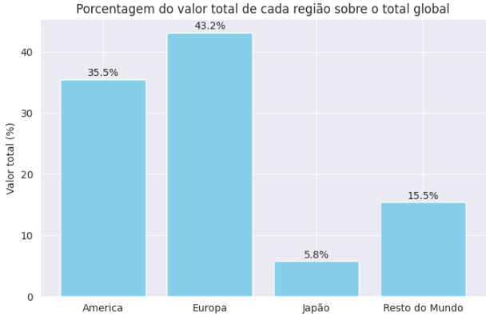

<h1>ps4-games-sales-analysis</h1>
<h3>Foi realizada uma Análise Exploratória de Dados (EDA) sobre o mercado de jogos de PlayStation 4, explorando tendências de vendas ao longo dos anos, diferenças regionais, gêneros mais populares e empresas com maior arrecadação global.</h3>  

  

Este README detalha o processo de análise exploratória de um dataset do Kaggle, desde a inspeção e preparação dos dados, análise estatística e exploratória em Python, insights e conclusão.

  

<h2>📖 Visão Geral</h2>

O objetivo deste projeto é compreender o comportamento do mercado de jogos de PS4 a partir de um dataset contendo informações de vendas por região, gênero e publisher, identificando padrões e tendências que influenciaram o desempenho global.

## 💾 Fonte dos Dados

O dataset utilizado foi o <strong>"Video Games Sales Dataset"</strong>, disponível na plataforma Kaggle.
  <ul>
  <li>Link para o Dataset: <a href="https://www.kaggle.com/datasets/sidtwr/videogames-sales-dataset?datasetId=189386&sortBy=voteCount" target="_blank">Video Games Sales Dataset on Kaggle</a</li>
  </ul>

   <h2>🔧 Processo do Projeto</h2>
  
  <h3>1. Preparação e Limpeza dos Dados</h3>
  
  
A primeira etapa consistiu em preparar o arquivo <code>.csv</code> original para análise, garantindo consistência e eliminando ruídos.

  
  <h4>Etapas Executadas:</h4>
  
  <ul>
  <li>Carregamento do Dataset: O arquivo PS4_GamesSales.csv foi carregado em Python utilizando pandas.</li>
  <li>Limpeza de Dados: Verificação de valores nulos e duplicados, garantindo consistência nos dados.</li>
  <li>Conversão de Tipos: Coluna Year foi convertida para int, para melhor precisão.</li>
  <li>Análise inicial com <code>.info()</code>, <code>.describe()</code> e <code>.head()</code></li>  
  <li>Resultado: Base de dados limpa e pronta para análise estatística e visual.</li>
</ul>

<h3>2. Análise Exploratória com Python</h3>

Com os dados tratados, foi feita uma análise exploratória (EDA) utilizando Seaborn e Matplotlib para identificar padrões nas vendas globais.

<h4>Principais etapas e visualizações:</h4>

 <h5>📊 Vendas Globais por Ano:</h5>
 
 <ul>
  <li>As vendas globais atingiram o pico nos primeiros anos do PS4, com destaque para o período 2013–2016.</li>
  <li>A partir de 2017, observa-se queda contínua, possivelmente pela transição para a nova geração de consoles (PS5).</li>
</ul>

 <h5>🕹️ Vendas por Gênero:</h5>
 
 <ul>
  <li>Os gêneros Action e Shooter lideram as vendas globais.</li>
  <li>Gêneros de nicho, como Puzzle e Strategy, apresentaram menor desempenho.</li>
</ul>

 <h5>🏆 Top 10 Publishers:</h5>
 
 <ul>
  <li>Activision, Ubisoft e Electronic Arts dominam as vendas globais.</li>
  <li>O mercado mostra alta concentração, com poucas empresas detendo a maior parte das receitas.</li>
</ul>

 <h5>🌍 Distribuição Regional das Vendas:</h5>
 
 <ul>
  <li>Europa e América do Norte concentram cerca de 80% das vendas globais.</li>
  <li>Japão representa a menor parcela, enquanto o “Resto do Mundo” mantém desempenho estável ao longo dos anos.</li>
</ul>

<h3>3. Resultados e Insights</h3>

 <ul>
  <li>Período de pico: Entre 2014 e 2016, auge das vendas.</li>
  <li>Gêneros dominantes: Action e Shooter lideram.</li>
  <li>Publishers: Mercado concentrado em poucas empresas.</li>
  <li>Regiões dominantes: América do Norte e Europa juntas é igual a quase 80% das vendas globais.</li>
</ul>

<h3>4. Tecnologias Utilizadas</h3>

<ul>
  <li>Python</li>
  <li>Pandas e NumPy</li>
  <li>Matplotlib e Seaborn</li>
  <li>Google Colab / VSCode</li>
</ul>
  

<h2>📝Conclusão:</h2>

A análise das vendas de jogos de PS4 revelou insights importantes sobre o comportamento do mercado de games durante o ciclo de vida do console. Observou-se que o período entre 2014 e 2017 representou o auge das vendas globais, seguido por uma queda gradual nos anos seguintes, reflexo natural da transição para a nova geração de consoles.

Os gêneros Action e Shooter se destacaram como os mais populares, evidenciando a preferência dos jogadores por experiências dinâmicas e competitivas. Em contrapartida, gêneros mais nichados, como Puzzle e Strategy, apresentaram vendas mais modestas.

A análise das publishers mostrou uma forte concentração de mercado, com poucas empresas — como Activision, Ubisoft e Electronic Arts — dominando a maior parte das vendas globais. Esse cenário reflete a influência dessas grandes marcas na indústria de games.

Por fim, a distribuição regional indicou que América do Norte e Europa são os principais mercados consumidores, somando juntas quase 80% das vendas globais, enquanto o Japão e o Resto do Mundo possuem participações menores, mas consistentes.

Em resumo, o estudo demonstra como uma análise exploratória de dados pode revelar tendências de mercado, preferências de consumo e padrões regionais relevantes para a indústria dos videogames.

